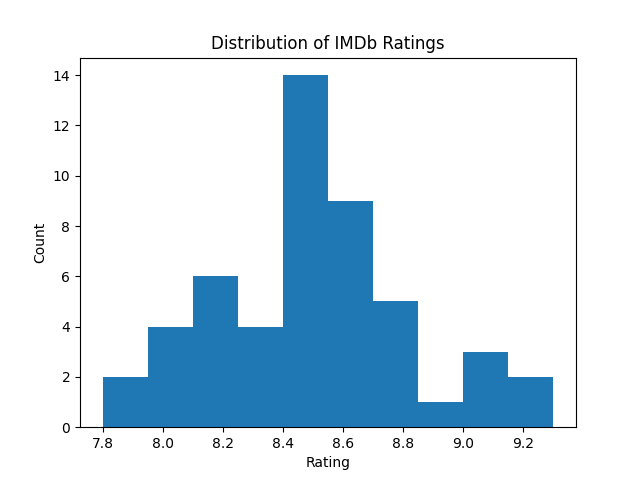
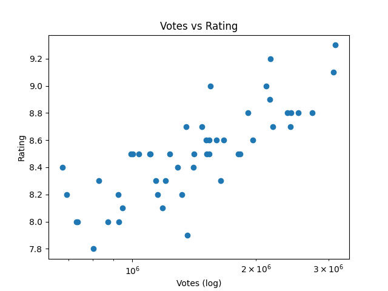

# IMDb Movie Popularity Analysis (Python, OMDb API)

A data analysis project investigating movie popularity and ratings on IMDb.
The project covers the full data pipeline: API data collection, preprocessing,
exploratory analysis, and visualization.

## Project Goal
To analyze patterns in IMDb ratings, votes, and popularity across movies from
different decades using data collected directly from the OMDb API.

## Data Collection
- Movie metadata was collected using the OMDb API
- Approximately 50 well-known movies were selected across multiple decades
- Data included ratings, vote counts, release year, runtime, genres, and box office earnings
- Raw data was saved as `raw_imdb_movies.csv`

## Data Preprocessing
Several cleaning steps were required:
- Handling missing or `N/A` values
- Converting string fields to numeric values (votes, runtime, box office)
- Removing duplicate entries
- Standardizing inconsistent formats

The cleaned dataset was saved as `cleaned_imdb_movies.csv`.

## Exploratory Analysis
Key analyses included:
- Distribution of IMDb ratings
- Relationship between number of votes and ratings
- Comparison of ratings across decades
- Identification of highest-rated movies

## Visualizations
The project includes:
- Histogram of IMDb ratings
- Scatter plot of votes vs ratings (log scale)
- Bar chart of the top 10 highest-rated movies

All plots are saved in `data/plots/`.

## Key Findings
- High popularity does not guarantee higher ratings
- Strongly rated movies appear across all decades
- Box office success and ratings are weakly correlated
- Classic films consistently appear among top-rated movies

## Technologies Used
- Python
- Pandas
- Requests
- Matplotlib
- OMDb API

## Project Structure
imdb-movie-analysis/
├── scripts/
│ ├── data_collection.py
│ ├── preprocessing.py
│ ├── analysis.py
│ └── visualization.py
├── data/
│ ├── raw_imdb_movies.csv
│ ├── cleaned_imdb_movies.csv
│ └── plots/
└── README.md

## Demo

## What I Learned
- Working with external APIs
- Building a full data analysis pipeline
- Cleaning real-world messy datasets
- Extracting insights through visualization
